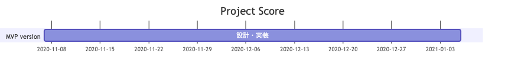
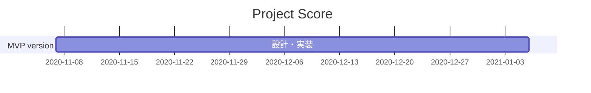

# Inception Deck (インセプションデッキ)

## 1. Why Are We Here ? (我われはなぜここにいるのか)

- 自分のプロジェクトを管理するため
- React × Firebase の組み合わせで新しい技術を試すため

- **自分が使いやすいプロジェクト管理ツールを自作する**

## 2. Create an Elevator Pitch (エレベーターピッチ)

- **プロジェクトを把握・管理・記録・シェア**したい
- **個人**向けの、
- **Project Score**というプロダクトは、
- **PC向けWebアプリケーション**です。
- これは**各々のプロジェクトのフローを閲覧・記録**ができ、
- **他のプロジェクト管理アプリ**とは違って、
- **ログインなしでプロジェクトの閲覧ができるオープンな機能**が備わっています。

## 3. Design a Product Box (パッケージデザイン)

（省略）

## 4. Create a NOT List (やらないことリスト)

| カテゴリ   | 項目                   | やる / やらない / あとで決める | 理由                                             |
| ---------- | ---------------------- | ------------------------------ | ------------------------------------------------ |
| 機能       | PJ作成・変更・削除機能 | やる                           |                                                  |
| 機能       | ログイン機能           | やる                           | プロジェクトの管理に必須なため                   |
| デザイン   | 細微なUIデザイン設計   | やらない                       | シンプルで軽い最低限のアプリケーションにするため |
| マネタイズ | 課金機能・広告の導入   | やらない                       | 収益は特に考えていないため                       |
| DB設計     | 事前の入念なDB設計     | やらない                       | 機能に合わせて追加・変更していくため             |
| UI         | モバイルページ対応     | やらない                       | PCユーザーのみを対象にするため                   |
| テスト     | テストコードの実装     | あとで決める                   | 一通りの完成を優先させるため                     |
| 開発環境   | CI／CD環境の構築       | あとで決める                   | とりあえず後回し                                 |

## 5. Meet Your Neighbors (「ご近所さん」を探せ)

（募集中。。）

## 6. Show the Solution (解決案を描く)

### 採用する技術

| 項目                       | 詳細             |
| -------------------------- | ---------------- |
| 言語                       | TypeScript       |
| フレームワーク・ライブラリ | React            |
| DB                         | Firestore        |
| ソースコード管理           | Git              |
| プロジェクト管理           | GitHub           |
| 動作環境                   | Chrome           |
| その他                     | Firebase, VSCode |

## 7. Ask What Keeps Us Up at Night (夜も眠れなくなる問題はなんだろう？)

- 自分が使えない（使いにくい）アプリケーションになること

## 8. Size It Up (期間を見極める)

## 9. Be Clear on What’s Going to Give (トレードオフ・スライダー)

### 典型的なフォース

|  max  |  >>>  |  >>>  |  >>>  |  min  | 項目                           |
| :---: | :---: | :---: | :---: | :---: | :----------------------------- |
|       |       |   o   |       |       | 機能をぜんぶ揃える（スコープ） |
|       |       |       |   o   |       | 予算内に収める（予算）         |
|       |       |   o   |       |       | 期日を死守する（時間）         |
|       |       |   o   |       |       | 高い品質、少ない欠陥（品質）   |

### 上記以外で重要なこと

|  max  |  >>>  |  >>>  |  >>>  |  min  | 項目                 |
| :---: | :---: | :---: | :---: | :---: | :------------------- |
|   o   |       |       |       |       | 使い勝手             |
|   o   |       |       |       |       | とにかくシンプルに！ |
|       |       |   o   |       |       | 見た目               |
|       |       |       |       |   o   | 詳細な監査ログ       |

## 10. Show What It’s Going to Take (何がどれだけ必要なのか)

| 要素 | 値     |
| ---- | ------ |
| 人数 | 1名    |
| 期間 | 3ヶ月~ |
| 予算 | $0     |

---

## 参考サイト

- [エレベーターピッチで新規事業や既存事業の整理力を鍛える！](https://theturningpoint.info/elevator-pitch/)
- [［アプリ開発ログ］インセプションデッキを作る](https://note.com/tonarinotororo/n/nc73596c8cb86)
- [インセプションデッキ の テンプレート (日本語版)](https://github.com/agile-samurai-ja/support/tree/master/blank-inception-deck)
- [スクラムで使う「インセプションデッキ」のmarkdown形式版テンプレート](https://qiita.com/bremen/items/ed491246ed83630bc84d)

